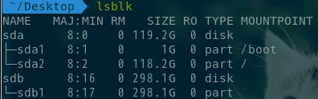

[Introduction-of-documents](README.md) [中文文档](README-zh.md)

# Explanation
This is the theme of a Grub2

# How to install the Grub2 theme
Requirements for the environment: efi+gpt, archlinux
 My partition:
 

 

 copy files Griffin-Grub-v2.0 to /boot/grub/themes/ partition, there is a script, will automatically process theme theme files.
 command:
 cd /boot/grub/themes/Griffin-Grub-v2.0/
 chmod +x Install-Arch.sh (generally negligible, can be used).
 sudo./Install-Arch.sh
 No, then reboot, you can see.
 ote: If you are Ubuntu, in general, please change the Install-Arch.sh above to Install-Ubuntu.sh.

# Update content
This Grub-Themes is modified based on the Shenron007/Grub-Themes source file in githun.
 link: https://github.com/Shenron007/Grub-Themes/tree/griffin-grub
 simply change the grub-update command to grub-mkconfig -o /boot/grub/grub.cfg.