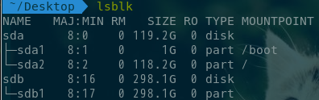

[Introduction-of-documents](README.md) [English document](README-en.md)

# 说明
这是一个grub2的主题

[参考图片](picture/003.png)
# 如何安装grub2主题
要求环境：efi+gpt、archlinux
我的分区：




复制文件Griffin-Grub-v2.0到/boot/grub/themes/分区下，里面有个脚本，会自动处理theme主题文件
```
命令：
cd /boot/grub/themes/Griffin-Grub-v2.0/
chmod +x Install-Arch.sh	#一般可以忽略，能用就行
sudo ./Install-Arch.sh
```
没有然后了，直接**reboot**，就可以看到了。
备注：如果你是**Ubuntu**,一般情况，请把上面Install-Arch.sh换成Install-Ubuntu.sh

# 更新内容
本Grub-Themes基于githun里的Shenron007/Grub-Themes源文件修改的
链接：https://github.com/Shenron007/Grub-Themes/tree/griffin-grub
只是将grub-update命令改为grub-mkconfig -o /boot/grub/grub.cfg
并未做其它任何修改


更新时间：20180502
